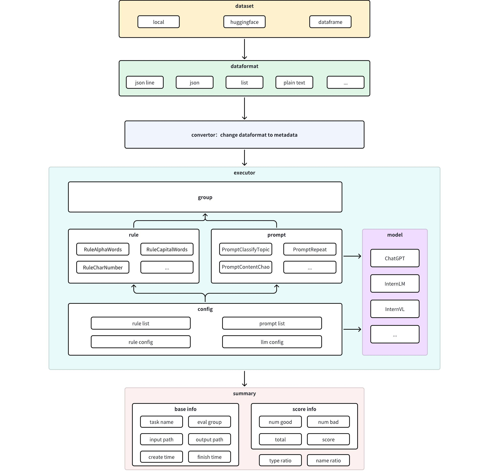

<div align="center" xmlns="http://www.w3.org/1999/html">
<!-- logo -->
<p align="center">
  
</p>

<!-- icon -->
[](https://github.com/pre-commit/pre-commit)

</div>

[English](README.md) | [简体中文](README_CN.md)

# Changelog

- 2024/12/27: Project Initialization

# Introduction

Dingo is a data quality evaluation tool that helps you automatically detect data quality issues in your datasets. Dingo provides a variety of built-in rules and model evaluation methods, and also supports custom evaluation methods. Dingo supports commonly used text datasets and multimodal datasets, including pre-training datasets, fine-tuning datasets, and evaluation datasets. In addition, Dingo supports multiple usage methods, including local CLI and SDK, making it easy to integrate into various evaluation platforms, such as [OpenCompass](https://github.com/open-compass/opencompass).

## Architecture Diagram


## Scenario Diagram



# Quick Start

Users can use Dingo in two ways as shown below.

## Installation

Install `dingo`

```shell
pip install dingo-python
```
## SDK

Try to run the `SDK` call method below:

```python
from dingo.io import InputArgs
from dingo.exec import Executor

input_data = {
    "eval_group": "sft", # rule list for sft data, other ['default', 'pretrain' ...]
    "input_path": "tatsu-lab/alpaca", # dataset from huggingface
    "data_format": "plaintext", # data format, other ['json', 'jsonl', 'plaintext']
    "save_data": True, # save data to local
}

input_args = InputArgs(**input_data)
executor = Executor.exec_map["local"](input_args)
result = executor.execute()
print(result)
```

For more usage examples, please refer to [examples](examples), for more evaluation results, please refer to [evaluation](docs/eval), and for more configurations, please refer to [config](docs/config.md).

## CLI

Try to run the `CLI` call rule set evaluation below:

``` shell
python -m dingo.run.cli --input_path tatsu-lab/alpaca -e sft --data_format plaintext --save_data True
```

Or try to run the `CLI` call gpt-4o model evaluation below:

```shell
python -m dingo.run.cli --input_path test/data/test_local_json.json --dataset local -e openai --data_format json --column_content prediction --custom_config test/config/config_gpt.json --save_data True
```

Note that calling the model evaluation requires adding the corresponding configuration, such as the configuration used in the above example:

```shell
$ cat test/data/config_gpt.json
{
  "llm_config": {
    "openai": {
      "model": "gpt-4o",
      "key": "xxxx", 
      "api_url": "https://api.openai.com/v1/chat/completions"
    }
  }
}
```

## GUI

After the project runs on the `cli` side, if the user sets the save_data parameter to True, a frontend page will be automatically generated based on the quality inspection results.
If the user wants to manually start a frontend page, you need to enter the following command:

```shell
python -m dingo.run.vsl --input xxx
```

The input followed is the directory of the quality inspection results. Users need to ensure that there is a summary.json file when the directory is opened.

# Feature List

## Supports multiple input data sources, data types, and data modalities

Dingo supports local files, huggingface datasets, S3 storage files as data sources; supports pre-training, fine-tuning, and evaluation datasets as data types; supports text and image data modalities.

## Supports custom rules, model evaluation

Dingo has built-in 20+ general heuristic rule evaluations, common LLMs (such as OpenAI, kimi, etc.) evaluations, and launching local specified model (llama3, etc.) evaluations.
Built-in heuristic rules have built-in multiple rule set combinations such as pretrain, sft according to the dataset type.
Both rules and model evaluations support customization or modification.
Supports data security evaluation, such as perspective API.

## Supports multiple interface usage methods, good extensibility, and easy to integrate

Dingo supports multiple interface usage methods, including local CLI and SDK, making it easy to integrate into various evaluation platforms, such as OpenCompass.

## Supports multiple execution engines

Dingo supports local and SPARK two execution engines, which is convenient for executing data evaluation tasks of various sizes.

## Supports multi-dimensional metric reports, traceable

Dingo supports outputting 7 Quality Metrics summary reports and abnormal data trace details reports.

# Concept Introduction

## Metric Introduction

[Metric Document](docs/metrics.md)

## Rule Introduction

[Rule Document](docs/rules.md)

## eval_group Introduction

[eval_group Document](docs/groups.md)

## Response Introduction

[Response Document](docs/response.md)

# User Guide

## Installation

The installation mentioned in the quick start module above only installs the necessary packages required for running, and some special function packages are not installed. If users need to install corresponding packages during the practice use process,
then you can refer to: [Install Dependencies](requirements)

## Register Rules/Prompts/Models

If the heuristic rules inside the project do not meet the user's quality inspection requirements, users can also customize rules or models.  

### Register Rules

If the user wants to create a new rule `CommonPatternDemo`, then the first step is to add a decorator to the rule to inject the rule into the project.  
Secondly, the `metric_type` type, such as `QUALITY_BAD_RELEVANCE`, needs to be set for the rule, and `group` does not need to be set.  
Then the user needs to define the `DynamicRuleConfig` object, so that the properties of the rule can be configured dynamically.  
In addition, the method name of the rule must be `eval` and it needs to be a class method.  
The return value of the last step should be a `ModelRes` object.  

For example: [Register Rules](examples/register/sdk_register_rule.py) 

### Register Prompts

Users can also register prompts, the method is similar to when registering rules.

For example: [Register Prompts](examples/register/sdk_register_prompt.py)

### Register Models

The way to register models is slightly different, users need to implement a call_api method, accept MetaData type parameters, and return ModelRes type results.  
There are already implemented basic model classes [BaseOpenAI](dingo/model/llm/base_openai.py) in the project, users can directly inherit.  
If the user has special functions to implement, then you can rewrite the corresponding methods.

For example: [Register Models](examples/register/sdk_register_llm.py)

## Configuration

[Configuration Document](docs/config.md)

## Execution Engine

`Dingo` can run locally or on a spark cluster.  
Regardless of the choice of engine, the executor supports some common methods:

| function name      | description              |
|--------------------|--------------------------|
| get_summary        | get the summary of test. |
| get_bad_info_list  | get the bad data.        |
| get_good_info_list | get the good data.       |


### Local Mode

When choosing the spark engine, users can freely choose rules, models for quality inspection.

[Local Example](examples/dataset/sdk_local.py)

### Spark Mode

When choosing the spark engine, users can only choose rules for quality inspection, and models cannot be used.  
And only `eval_group`,`save_data`,`save_correct`,`custom_config` in `InputArgs` are still valid.  
Therefore, the user needs to input `spark_session` to initialize spark, and input `spark_rdd` (composed of `MetaData` structure) as data for quality inspection.  
It should be noted that if `save_data` is `False`, then the data in memory will be cleared immediately after the quality inspection is completed, and `spark_session` will also stop immediately.

[Spark Example](examples/spark/sdk_spark.py)

## Evaluation Report
After completing an evaluation, Dingo will generate a summary report (summary) and a detailed report (detail). The summary includes the overall score Score and the scores of the 7 Quality Metrics dimensions of this evaluation. The detailed report will include the specific data content of each Quality Metrics evaluation with exceptions, which is convenient for tracing the cause.
The `summary.json` profile file example is as follows:

```shell
{
    "task_id": "d6c922ec-981c-11ef-b723-7c10c9512fac",
    "task_name": "dingo",
    "eval_group": "default",
    "input_path": "test/data/test_local_jsonl.jsonl",
    "output_path": "outputs/d6c921ac-981c-11ef-b723-7c10c9512fac",
    "create_time": "20241101_144510",
    "score": 50.0,
    "num_good": 1,
    "num_bad": 1,
    "total": 2,
    "type_ratio": {
        "QUALITY_BAD_COMPLETENESS": 0.5,
        "QUALITY_BAD_RELEVANCE": 0.5
    },
    "name_ratio": {
        "QUALITY_BAD_COMPLETENESS-RuleColonEnd": 0.5,
        "QUALITY_BAD_RELEVANCE-RuleSpecialCharacter": 0.5
    }
}
```

The detailed report such as the `RuleColonEnd.json` file example is as follows:

```shell
{"data_id": "1", "prompt": "", "content": "�I am 8 years old. ^I love apple because:", "type_list": ["QUALITY_BAD_COMPLETENESS", "QUALITY_BAD_RELEVANCE"], "name_list": ["QUALITY_BAD_COMPLETENESS-RuleColonEnd", "QUALITY_BAD_RELEVANCE-RuleSpecialCharacter"], "reason_list": ["�I am 8 years old. ^I love apple because:", ["�"]]}

```

## TODO

- [ ] Richer graphic and text evaluation indicators;
- [ ] New audio and video data modality evaluation;
- [ ] New small model evaluation, such as fasttext, Qurating;
- [ ] New data diversity evaluation;

# Limitations

- The current evaluation tool's built-in detection rules and model methods mostly come from papers, open source projects, etc., mainly focusing on common data quality problems. If there is a need to evaluate special data problems, it is recommended to customize the corresponding detection rules for evaluation;

# Acknowledgments

- [RedPajama-Data](https://github.com/togethercomputer/RedPajama-Data)
- [mlflow](https://github.com/mlflow/mlflow)

# Contribution

We appreciate all the contributors for their efforts to improve and enhance `Dingo`. Please refer to the [Contribution Guide](docs/en/CONTRIBUTING.md) for guidance on contributing to the project.

# License

This project uses the [Apache 2.0 Open Source License](LICENSE).

# Citation

If you find this project useful, please consider citing our tool:

```
@misc{dingo,
  title={Dingo: A Comprehensive Data Quality Evaluation Tool for Large Models},
  howpublished={\url{https://github.com/DataEval/dingo}},
  year={2024}
}
```