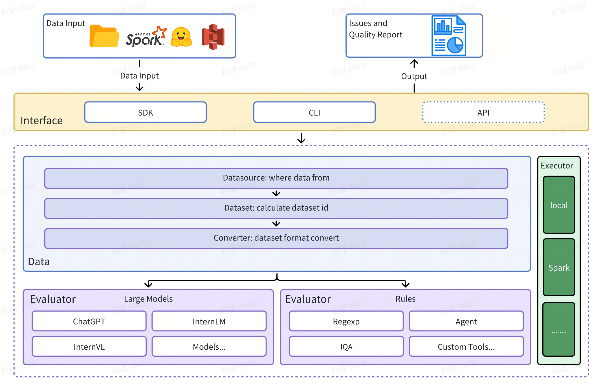

<div align="center" xmlns="http://www.w3.org/1999/html">
<!-- logo -->
<p align="center">
  
</p>

<!-- badges -->
<p align="center">
  <a href="https://github.com/pre-commit/pre-commit"></a>
  <a href="https://pypi.org/project/dingo-python/"></a>
  <a href="https://pypi.org/project/dingo-python/"></a>
  <a href="https://github.com/DataEval/dingo/blob/main/LICENSE"></a>
  <a href="https://github.com/DataEval/dingo/stargazers"></a>
  <a href="https://github.com/DataEval/dingo/network/members"></a>
  <a href="https://github.com/DataEval/dingo/issues"></a>
  <a href="https://mseep.ai/app/dataeval-dingo"></a>
</p>

</div>


<div align="center">

[English](README.md) · [简体中文](README_zh-CN.md) · [日本語](README_ja.md)

</div>


<!-- join us -->

<p align="center">
    👋 <a href="https://discord.gg/Jhgb2eKWh8" target="_blank">Discord</a>と<a href="./docs/assets/wechat.jpg" target="_blank">WeChat</a>でご参加ください
</p>


# 更新履歴

- 2024/12/27: プロジェクト初期化

# はじめに

Dingoは、データセット内のデータ品質問題を自動的に検出するデータ品質評価ツールです。Dingoは様々な組み込みルールとモデル評価手法を提供し、カスタム評価手法もサポートしています。Dingoは一般的に使用されるテキストデータセットとマルチモーダルデータセット（事前学習データセット、ファインチューニングデータセット、評価データセットを含む）をサポートしています。さらに、DingoはローカルCLIやSDKなど複数の使用方法をサポートし、[OpenCompass](https://github.com/open-compass/opencompass)などの様々な評価プラットフォームに簡単に統合できます。

## アーキテクチャ図



# クイックスタート

## インストール

```shell
pip install dingo-python
```

## 使用例

### 1. LLMチャットデータの評価

```python
from dingo.config.config import DynamicLLMConfig
from dingo.io.input.MetaData import MetaData
from dingo.model.llm.llm_text_quality_model_base import LLMTextQualityModelBase
from dingo.model.rule.rule_common import RuleEnterAndSpace

data = MetaData(
    data_id='123',
    prompt="hello, introduce the world",
    content="Hello! The world is a vast and diverse place, full of wonders, cultures, and incredible natural beauty."
)

def llm():
    LLMTextQualityModelBase.dynamic_config = DynamicLLMConfig(
        key='YOUR_API_KEY',
        api_url='https://api.openai.com/v1/chat/completions',
        model='gpt-4o',
    )
    res = LLMTextQualityModelBase.eval(data)
    print(res)


def rule():
    res = RuleEnterAndSpace().eval(data)
    print(res)
```

### 2. データセットの評価

```python
from dingo.io import InputArgs
from dingo.exec import Executor

# Hugging Faceからデータセットを評価
input_data = {
    "eval_group": "sft",           # SFTデータ用のルールセット
    "input_path": "tatsu-lab/alpaca", # Hugging Faceからのデータセット
    "data_format": "plaintext",    # フォーマット: plaintext
    "save_data": True              # 評価結果を保存
}

input_args = InputArgs(**input_data)
executor = Executor.exec_map["local"](input_args)
result = executor.execute()
print(result)
```

## コマンドラインインターフェース

### ルールセットでの評価

```shell
python -m dingo.run.cli --input_path data.txt --dataset local -e sft --data_format plaintext --save_data True
```

### LLM（例：GPT-4o）での評価

```shell
python -m dingo.run.cli --input_path data.json --dataset local -e openai --data_format json --column_content text --custom_config config_gpt.json --save_data True
```

`config_gpt.json`の例:
```json
{
  "llm_config": {
    "openai": {
      "model": "gpt-4o",
      "key": "YOUR_API_KEY",
      "api_url": "https://api.openai.com/v1/chat/completions"
    }
  }
}
```

## GUI可視化

評価後（`save_data=True`で）、フロントエンドページが自動的に生成されます。手動でフロントエンドを開始するには：

```shell
python -m dingo.run.vsl --input output_directory
```

ここで`output_directory`は`summary.json`ファイルを含む評価結果が格納されているディレクトリです。


## オンラインデモ
オンラインデモでDingoをお試しください: [(Hugging Face)🤗](https://huggingface.co/spaces/DataEval/dingo)

## ローカルデモ
地元でDingoを試してみましょう：

```shell
cd app_gradio
python app.py
```


## Google Colabデモ
Google ColabノートブックでDingoをインタラクティブに体験してください：[](https://colab.research.google.com/github/DataEval/dingo/blob/dev/examples/colab/dingo_colab_demo.ipynb)


# MCPサーバー

Dingoには実験的なModel Context Protocol（MCP）サーバーが含まれています。サーバーの実行とCursorなどのクライアントとの統合の詳細については、専用のドキュメントをご覧ください：

[English](README_mcp.md) · [简体中文](README_mcp_zh-CN.md) · [日本語](README_mcp_ja.md)

## ビデオデモンストレーション

Dingo MCPを素早く始められるよう、ビデオウォークスルーを作成しました：

https://github.com/user-attachments/assets/aca26f4c-3f2e-445e-9ef9-9331c4d7a37b

このビデオでは、Dingo MCPサーバーをCursorと一緒に使用する方法をステップバイステップで説明しています。


# データ品質メトリクス

Dingoはデータ品質問題を7つの品質メトリクス次元に分類します。各次元は、ルールベース手法とLLMベースプロンプトの両方で評価できます：

| 品質メトリクス | 説明 | ルール例 | LLMプロンプト例 |
|----------------|------|----------|-----------------|
| **COMPLETENESS** | データが不完全または欠落していないかをチェック | `RuleColonEnd`, `RuleContentNull` | テキストがコロンや省略記号で突然終わっているか、括弧が不一致か、重要な要素が欠落していないかを評価 |
| **EFFECTIVENESS** | データが意味があり適切にフォーマットされているかをチェック | `RuleAbnormalChar`, `RuleHtmlEntity`, `RuleSpecialCharacter` | 文字化けテキスト、スペースなしで結合された単語、適切な句読点のないテキストを検出 |
| **FLUENCY** | テキストが文法的に正しく自然に読めるかをチェック | `RuleAbnormalNumber`, `RuleNoPunc`, `RuleWordStuck` | 過度に長い単語、句読点のないテキスト断片、読み順が混乱したコンテンツを識別 |
| **RELEVANCE** | データ内の無関係なコンテンツを検出 | 異なる言語用の`RuleHeadWord`バリアント | 引用詳細、ヘッダー/フッター、エンティティマーカー、HTMLタグなどの無関係な情報を検査 |
| **SECURITY** | 機密情報や価値観の対立を識別 | `RuleIDCard`, `RuleUnsafeWords` | 個人情報、ギャンブル、ポルノ、政治問題に関連するコンテンツをチェック |
| **SIMILARITY** | 反復的または非常に類似したコンテンツを検出 | `RuleDocRepeat` | 連続した反復コンテンツや特殊文字の複数出現についてテキストを評価 |
| **UNDERSTANDABILITY** | データがどれだけ容易に解釈できるかを評価 | `RuleCapitalWords` | LaTeX数式とMarkdownが正しくフォーマットされ、適切なセグメンテーションと改行があることを確認 |

## LLM品質評価

Dingoは`dingo/model/prompt`ディレクトリ内のプロンプトで定義された複数のLLMベース評価手法を提供します。これらのプロンプトは`prompt_register`デコレータを使用して登録され、品質評価のためにLLMモデルと組み合わせることができます：

### テキスト品質評価プロンプト

| プロンプトタイプ | メトリクス | 説明 |
|------------------|------------|------|
| `TEXT_QUALITY_V2`, `TEXT_QUALITY_V3` | 様々な品質次元 | 効果性、関連性、完全性、理解しやすさ、類似性、流暢性、セキュリティを含む包括的なテキスト品質評価 |
| `QUALITY_BAD_EFFECTIVENESS` | 効果性 | 文字化けテキストとアンチクローリングコンテンツを検出 |
| `QUALITY_BAD_SIMILARITY` | 類似性 | テキスト反復問題を識別 |
| `WORD_STICK` | 流暢性 | 適切なスペースなしで結合された単語をチェック |
| `CODE_LIST_ISSUE` | 完全性 | コードブロックとリストフォーマット問題を評価 |
| `UNREAD_ISSUE` | 効果性 | エンコーディング問題による読み取り不可能な文字を検出 |

### 3H評価プロンプト（正直、有用、無害）

| プロンプトタイプ | メトリクス | 説明 |
|------------------|------------|------|
| `QUALITY_HONEST` | 正直性 | 捏造や欺瞞なしに正確な情報を提供するかどうかを評価 |
| `QUALITY_HELPFUL` | 有用性 | 質問に直接答え、指示に適切に従うかどうかを評価 |
| `QUALITY_HARMLESS` | 無害性 | 有害なコンテンツ、差別的言語、危険な支援を避けるかどうかをチェック |

### ドメイン固有評価プロンプト

| プロンプトタイプ | メトリクス | 説明 |
|------------------|------------|------|
| `TEXT_QUALITY_KAOTI` | 試験問題品質 | 数式レンダリング、表フォーマット、段落構造、回答フォーマットに焦点を当てた試験問題品質の専門評価 |
| `Html_Abstract` | HTML抽出品質 | HTMLからMarkdownを抽出する異なる手法を比較し、完全性、フォーマット精度、意味的一貫性を評価 |
| `DATAMAN_ASSESSMENT` | データ品質とドメイン | DataMan手法（14基準、15ドメイン）を使用して事前学習データ品質を評価。スコア（0/1）、ドメインタイプ、品質状態、理由を割り当て |

### 分類プロンプト

| プロンプトタイプ | メトリクス | 説明 |
|------------------|------------|------|
| `CLASSIFY_TOPIC` | トピック分類 | 言語処理、執筆、コード、数学、ロールプレイ、知識Q&Aなどのカテゴリにテキストを分類 |
| `CLASSIFY_QR` | 画像分類 | 画像をCAPTCHA、QRコード、または通常の画像として識別 |

### 画像評価プロンプト

| プロンプトタイプ | メトリクス | 説明 |
|------------------|------------|------|
| `IMAGE_RELEVANCE` | 画像関連性 | 顔の数、特徴の詳細、視覚的要素の観点から、画像が参照画像と一致するかを評価 |

### 評価でのLLM評価の使用

これらの評価プロンプトを評価で使用するには、設定で指定します：

```python
input_data = {
    # その他のパラメータ...
    "custom_config": {
        "prompt_list": ["QUALITY_BAD_SIMILARITY"],  # 使用する特定のプロンプト
        "llm_config": {
            "detect_text_quality": {  # 使用するLLMモデル
                "model": "gpt-4o",
                "key": "YOUR_API_KEY",
                "api_url": "https://api.openai.com/v1/chat/completions"
            }
        }
    }
}
```

これらのプロンプトは、特定の品質次元に焦点を当てたり、特定のドメイン要件に適応させるためにカスタマイズできます。適切なLLMモデルと組み合わせることで、これらのプロンプトは複数の次元にわたる包括的なデータ品質評価を可能にします。

# ルールグループ

Dingoは異なるタイプのデータセット用に事前設定されたルールグループを提供します：

| グループ | 使用例 | ルール例 |
|----------|--------|----------|
| `default` | 一般的なテキスト品質 | `RuleColonEnd`, `RuleContentNull`, `RuleDocRepeat`など |
| `sft` | ファインチューニングデータセット | `default`のルールに加えて`RuleLineStartWithBulletpoint` |
| `pretrain` | 事前学習データセット | `RuleAlphaWords`, `RuleCapitalWords`などを含む20以上のルールの包括的セット |

特定のルールグループを使用するには：

```python
input_data = {
    "eval_group": "sft",  # "default", "sft", または "pretrain"を使用
    # その他のパラメータ...
}
```

# 機能ハイライト

## マルチソース・マルチモーダルサポート

- **データソース**: ローカルファイル、Hugging Faceデータセット、S3ストレージ
- **データタイプ**: 事前学習、ファインチューニング、評価データセット
- **データモダリティ**: テキストと画像

## ルールベース・モデルベース評価

- **組み込みルール**: 20以上の一般的なヒューリスティック評価ルール
- **LLM統合**: OpenAI、Kimi、ローカルモデル（例：Llama3）
- **カスタムルール**: 独自のルールとモデルで簡単に拡張
- **セキュリティ評価**: Perspective API統合

## 柔軟な使用方法

- **インターフェース**: CLIとSDKオプション
- **統合**: 他のプラットフォームとの簡単な統合
- **実行エンジン**: ローカルとSpark

## 包括的なレポート

- **品質メトリクス**: 7次元品質評価
- **トレーサビリティ**: 異常追跡のための詳細レポート

# ユーザーガイド

## カスタムルール、プロンプト、モデル

組み込みルールが要件を満たさない場合、カスタムルールを作成できます：

### カスタムルール例

```python
from dingo.model import Model
from dingo.model.rule.base import BaseRule
from dingo.config.config import DynamicRuleConfig
from dingo.io import MetaData
from dingo.model.modelres import ModelRes

@Model.rule_register('QUALITY_BAD_RELEVANCE', ['default'])
class MyCustomRule(BaseRule):
    """テキスト内のカスタムパターンをチェック"""

    dynamic_config = DynamicRuleConfig(pattern=r'your_pattern_here')

    @classmethod
    def eval(cls, input_data: MetaData) -> ModelRes:
        res = ModelRes()
        # ここにルール実装
        return res
```

### カスタムLLM統合

```python
from dingo.model import Model
from dingo.model.llm.base_openai import BaseOpenAI

@Model.llm_register('my_custom_model')
class MyCustomModel(BaseOpenAI):
    # ここにカスタム実装
    pass
```

詳細な例については以下をご覧ください：
- [ルール登録](examples/register/sdk_register_rule.py)
- [プロンプト登録](examples/register/sdk_register_prompt.py)
- [モデル登録](examples/register/sdk_register_llm.py)

## 実行エンジン

### ローカル実行

```python
from dingo.io import InputArgs
from dingo.exec import Executor

input_args = InputArgs(**input_data)
executor = Executor.exec_map["local"](input_args)
result = executor.execute()

# 結果を取得
summary = executor.get_summary()        # 全体的な評価サマリー
bad_data = executor.get_bad_info_list() # 問題のあるデータのリスト
good_data = executor.get_good_info_list() # 高品質データのリスト
```

### Spark実行

```python
from dingo.io import InputArgs
from dingo.exec import Executor
from pyspark.sql import SparkSession

# Sparkを初期化
spark = SparkSession.builder.appName("Dingo").getOrCreate()
spark_rdd = spark.sparkContext.parallelize([...])  # MetaDataオブジェクトとしてのデータ

input_args = InputArgs(eval_group="default", save_data=True)
executor = Executor.exec_map["spark"](input_args, spark_session=spark, spark_rdd=spark_rdd)
result = executor.execute()
```

## 評価レポート

評価後、Dingoは以下を生成します：

1. **サマリーレポート** (`summary.json`): 全体的なメトリクスとスコア
2. **詳細レポート**: 各ルール違反の具体的な問題

レポートの説明：
1. **score**: `num_good` / `total`
2. **type_ratio**: タイプの数 / 総数, 例: `QUALITY_BAD_COMPLETENESS` / `total`
3. **name_ratio**: 名前の数 / 総数, 例: `QUALITY_BAD_COMPLETENESS-RuleColonEnd` / `total`

サマリー例：
```json
{
    "task_id": "d6c922ec-981c-11ef-b723-7c10c9512fac",
    "task_name": "dingo",
    "eval_group": "default",
    "input_path": "test/data/test_local_jsonl.jsonl",
    "output_path": "outputs/d6c921ac-981c-11ef-b723-7c10c9512fac",
    "create_time": "20241101_144510",
    "score": 50.0,
    "num_good": 1,
    "num_bad": 1,
    "total": 2,
    "type_ratio": {
        "QUALITY_BAD_COMPLETENESS": 0.5,
        "QUALITY_BAD_RELEVANCE": 0.5
    },
    "name_ratio": {
        "QUALITY_BAD_COMPLETENESS-RuleColonEnd": 0.5,
        "QUALITY_BAD_RELEVANCE-RuleSpecialCharacter": 0.5
    }
}
```


# 研究・出版物

## Dingoを活用した研究
- **WanJuanSiLu**: [A High-Quality Open-Source Webtext Dataset for Low-Resource Languages](https://arxiv.org/pdf/2501.14506)
  *多言語ウェブデータの包括的なデータ品質評価にDingoを使用*

## Dingoに実装された手法
- **DataMan手法**: [DataMan: Data Manager for Pre-training Large Language Models](https://openreview.net/pdf?id=eNbA8Fqir4)
  *Dingoは事前学習データ品質評価のためのDataMan手法を実装*
- **RedPajama-Data-v2**: [RedPajama-Data](https://github.com/togethercomputer/RedPajama-Data)
  *Dingoはウェブテキストの品質評価とフィルタリングのためのRedPajama-Data-v2手法の一部を実装*

# 今後の計画

- [ ] より豊富なグラフィックとテキスト評価指標
- [ ] 音声・動画データモダリティ評価
- [ ] 小規模モデル評価（fasttext、Qurating）
- [ ] データ多様性評価

# 制限事項

現在の組み込み検出ルールとモデル手法は、一般的なデータ品質問題に焦点を当てています。専門的な評価ニーズについては、検出ルールのカスタマイズを推奨します。

# 謝辞

- [RedPajama-Data](https://github.com/togethercomputer/RedPajama-Data)
- [mlflow](https://github.com/mlflow/mlflow)

# 貢献

`Dingo`の改善と強化に努力してくださったすべての貢献者に感謝いたします。プロジェクトへの貢献に関するガイダンスについては、[貢献ガイド](docs/en/CONTRIBUTING.md)をご参照ください。

# ライセンス

このプロジェクトは[Apache 2.0オープンソースライセンス](LICENSE)を使用しています。

このプロジェクトは言語検出を含む一部の機能でfasttextを使用しています。fasttextはMITライセンスの下でライセンスされており、これは当社のApache 2.0ライセンスと互換性があり、様々な使用シナリオに柔軟性を提供します。

# 引用

このプロジェクトが有用だと思われる場合は、当社のツールの引用をご検討ください：

```
@misc{dingo,
  title={Dingo: A Comprehensive Data Quality Evaluation Tool for Large Models},
  author={Dingo Contributors},
  howpublished={\url{https://github.com/DataEval/dingo}},
  year={2024}
}
```
